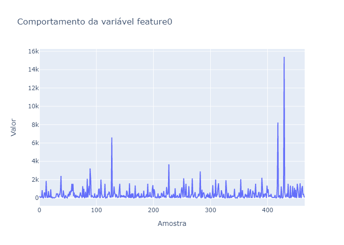
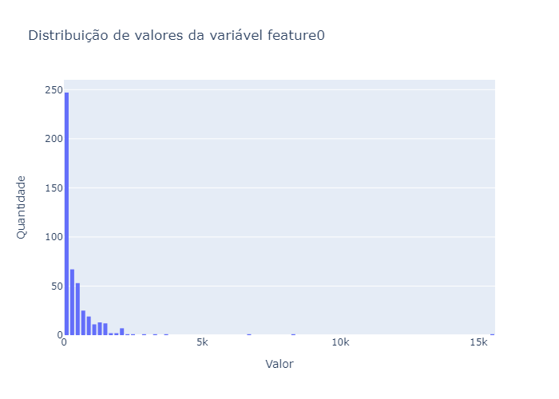
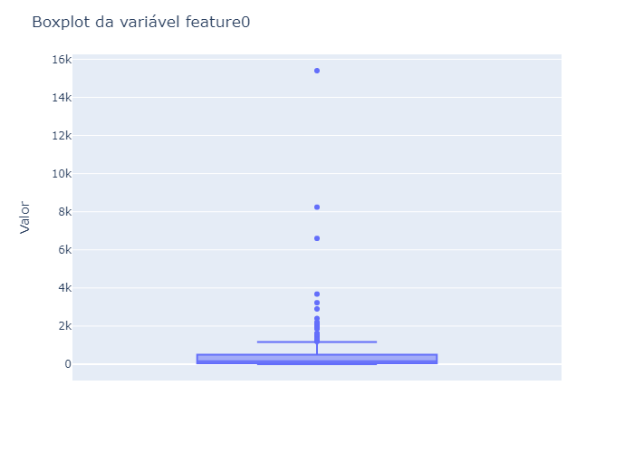
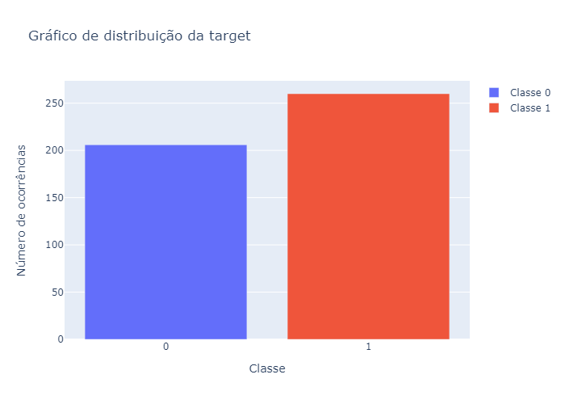
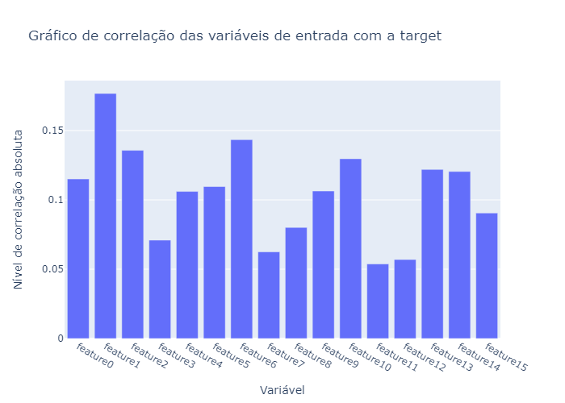
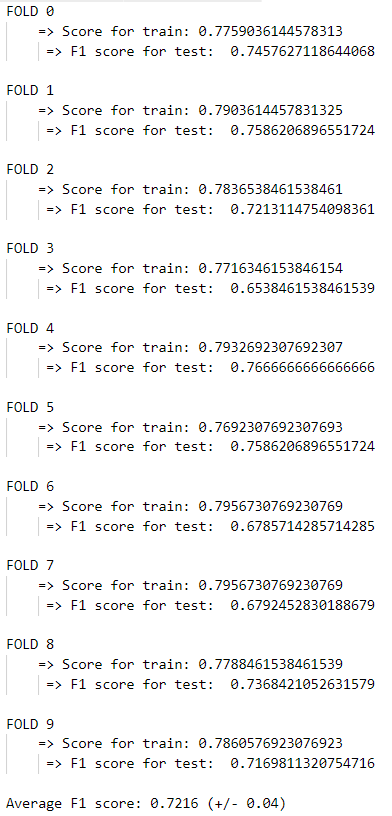
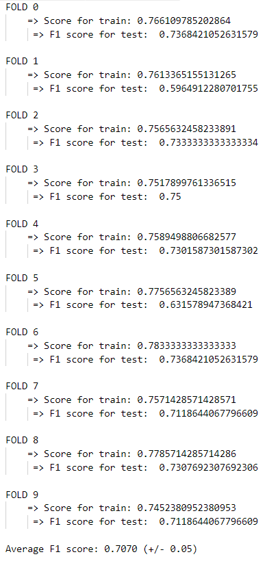
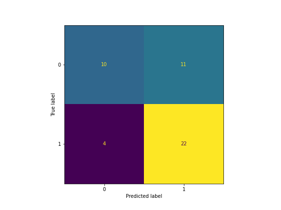
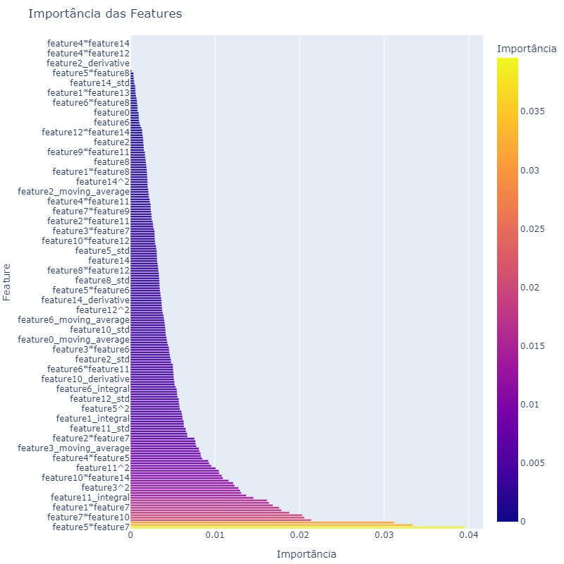

# Desafio Técnico - Americanas SA
A seguir, está documentado todo o <em>pipeline</em> para a resolução do desafio técnico proposto para a vaga de Cientista de Dados Jr., da Americanas SA, realizado pelo candidato <strong>João Victor Magalhães Souza</strong>.

## 1) Análise Exploratória
Primeiramente, busquei entender, através de gráficos, o comportamento das minhas variáveis de entrada. Na minha visão, através da análise gráfica podemos entender mais facilmente sobre as variáveis, principalmente nesse caso onde não sei o que é cada cada uma delas. Nas análises a seguir, serão mostrados apenas alguns gráficos como exemplo, porém, todos os gráficos plotados para a análise exploratória podem ser consultados na pasta <strong>"figures"</strong> ou até mesmo plotados em tempo de execução.
### 1.1) Gráficos de série temporal
Como não sei se essas variáveis estão organizadas cronologicamente, então criei, inicialmente, gráficos de séries temporais para cada uma das <em>features</em> no intuito <strong>simular</strong> como se essas variáveis estivessem dispostas no tempo. Entretanto, optei por utilizar o conceito de variáveis amostralmente (amostras) organizadas. Por exemplo, para a Feature 0, temos:
 

 
Neste tipo de gráfico eu já consigo ter alguns <em>insights</em> iniciais, como: qual é o <em>range</em> operacional, a grosso modo, de cada uma das variáveis; consigo observar também se essa variável possui <em>outliers</em>, como mostrado pelos picos na imagem acima. Eu considerei que tais picos são de fato <em>outliers</em>, embora eu não saiba sobre a natureza das variáveis mas, comumente, essas grandes oscilações (subidas e descidas) são consideradas como pontos fora da curva na maioria das aplicações reais.

### 1.2) Histogramas
Já possuindo uma visão macro do comportamento das variáveis, busquei plotar histogramas para ver a distribuição dos valores dessas variáveis de entrada.
 

 
Com os histogramas, eu consigo entender um pouco mais sobre os valores assumidos por essas variáveis, sua distribuição e, indiretamente, consigo perceber melhor se elas variam muito ou pouco ao longo das amostras. Essa é uma análise interessante, principalmente em aplicações reais visto que conseguimos imaginar se determinada variávei será útil ou não pois, geralmente, se uma variável varia muito pouco então provavelmente ela não trará muita informação sobre a <em>target</em>. Deixando claro que isso não se aplica para todos os casos.
Com essas duas análises iniciais (1.1 e 1.2), eu já percebi que haviam muitas variáveis que variavam muito pouco e, sendo assim, já comecei a imaginar que teria que arrumar alguma estratégia para agregar mais informação ao conjunto de dados, ponto que será discutido na seção 2.2.

### 1.3) <em>Boxplots</em>
Com os <em>boxplots</em> meu intuito é justamente ver algumas medidas estatísticas como mediana, min, max, IQR e também sobre os <em>outliers</em> para consolidar, em termos numéricos, o comportamento de tais variáveis:
 

 
Como podemos observar, a maior parte dos valores, para a Feature 0, está contida entre 0 e aproximadamente 1500 (observando o Intervalo Interquartil) e, graficamente, podemos confirmar alguns <em>outliers</em> que já haviam sido apontados nos gráficos de Séries Temporais (1.1).

Essas três primeiras análises são muito úteis pois já me fizeram perceber que uma limpeza nos dados seria extremamente relevante, uma vez que deixar que tais dados "sujos" fossem apresentados para meu modelo poderia dificultar ou até mesmo atrapalhar nas predições, já que esses dados não representam a realidade de determinada variável.

### 1.4) Distribuição da <em>target</em>
Como se trata de um problema de classificação binária, a minha última análise exploratória é pautada na verificação do balanceamento do meu problema: o meu intuito aqui é observar se era um problema balanceado ou desbalanceado:
 

 
Observo que temos um leve desbalanceamento entre as classes e, inicialmente, na minha visão, não será algo problemático para este desafio. Entretanto, já fico ciente que terei que utilizar uma métrica de avaliação de <em>performance</em> que leve em conta tal desbalanceamento, na visão de poder avaliar melhor (mais assertivamente) as predições.

### 1.5) Correlação das variáveis de entrada com a <em>target</em>
Por fim, outra análise que julguei interessante foi analisar as correlações das variáveis preditoras com a <em>target</em>, visando inspecionar o nível de informação que elas me dão sobre o que quero prever. Aqui, utilizei apenas a correlação de Pearson:
 

 
Como podemos observar, as correlações lineares entre as variáveis preditoras e a nossa variável-alvo estão bem baixas. Isso implica que teremos que enriquecer ainda mais os nossos dados se quisermos relizar boas predições.

## 2) Pré processamento dos dados (<em>Data Preparation</em>)
Uma vez que já entendo melhor tanto sobre meus dados de entrada quanto sobre minha <em>target</em>, é hora de fazer as correções necessárias nos dados de entrada devido as hipóteses levantadas na seção de Análise Exploratória(1).

### 2.1) Limpeza
Como mostrado na seção 1, existem alguns <em>outliers</em> no nosso conjunto de dados. Sendo assim, optei por tratá-los ao invés de excluí-los, já que possuo poucas amostras de dados. A limpeza utilizada nesta etapa foi por <strong>+- 1.5*IQR</strong>, pois as variáveis de entrada não apresentam distribuição normal e, sendo assim, uma limpeza por desvio-padrão não seria adequada. Optei por implementar uma substituição dos <em>outliers</em> pela mediana ao invés da média, pois obtive melhores resultados com a primeira abordagem.

### 2.2) <em>Feature Engineering</em>
Também evidenciado na seção de Análise Exporatória, foi possível observar que algumas variáveis variam bem pouco e que elas possuem uma correlação muito baixa com a nossa <em>target</em>. Uma boa estratégia para agregar mais informação aos dados de entrada é através do processo de <em>Feature Engineering</em>. Como todas as variáveis de entrada são numéricas, as estratégias que pensei para este desafio foram:
- <strong>Derivada:</strong> a minha ideia aqui é calcular a taxa de variação das variáveis preditoras. Assim, eu consigo explicitar para meu modelo de <em>Machine Learning</em> o quanto uma variável variou de uma amostra para a outra ao longo de todas as suas amostras.
- <strong>Integral:</strong> nessa nova <em>feature</em>, meu objetivo é calcular o somatório de uma variável em uma janela móvel de 5 amostras. É parecido com uma média móvel mas ao invés de calcular a média, calculo o somatório dessa variável. 
- <strong>Momentos Estatísticos Móveis:</strong> outras novas variáveis que achei que poderiam ser interessantes são a média e desvio-padrão móveis. Ambas foram calculadas em uma janela móvel de 5 amostras.
- <strong>Combinações Polinomiais:</strong> por fim, criei também as combinações polinomiais que são, basicamente todas as possíveis multiplicações entre pares de variáveis e, além disso, a potência de 2 de todas as variáveis de entrada. Assim como a Integral, essas propostas não têm uma semântica clara, ou seja, possuem apenas um viés matemático. Mesmo assim, na grande maioria dos casos, essas propostas conseguem agregar um nível significativo de informação nos conjuntos de dados nas quais são aplicadas.

Ao término deste processo, de 15 variáveis de entrada vamos para 201 variáveis de entrada.

<strong>Observação importante:</strong> como neste ponto eu já pretendia utilizar algum modelo baseado em árvores, eu cheguei a implementar etapas como normalização e <em>feature selection</em> mas ambas não foram necessárias e não fazem sentido quando usamos modelos à base de árvores.

## 3) <em>Split</em> dos dados
Antes de criar o meu modelo, eu resolvi dividir os dados em 10 <em>folds</em> estratificados (KFoldStratified), visando manter a proporção levemente desbalanceada do nosso problema. O objetivo dessa divisão das <em>folds</em> é poder avaliar o quão generalizável o nosso modelo está. A ideia, então, é que ele apresente um comportamento o mais similar possível para todas as <em>folds</em> criadas. 

## 4) Modelagem
Como dito anteriormente, eu já pretendia utilizar algum algoritmo baseado em árvores. Eu havia pensado inicialmente em utilizar ou o <em>XGBoost</em>, ou o <em>CatBoost</em> ou o <em>RandomForest</em>, principalmente devido ao fato de serem modelos muito eficientes em problemas de classificação e muito simples de serem utilizados. Entretanto, após alguns testes com as três abordagens, optei por utilizar o <em>RandomForest</em> na tentativa de tornar menos complexo o meu modelo, visto que identifiquei, inicialmente, uma dificuldade muito grande em tratar o <em>overfitting</em> do <em>XGBoost</em> e do <em>CatBoost</em> para este problema. Após um <em>tunning</em> de hiperparâmetros com a utilização do Optuna, a melhor configuração obtida para o <em>RandomForest</em> foi:
- <strong>Número de Árvores:</strong> 100.
- <strong>Profundidade Máxima:</strong> 4.
- <strong>Critério de Avaliação:</strong> entropy.
- <strong>Número Mínimo de Amostras nos Nós Folha:</strong> 10.
- <strong>Random Seed:</strong> 42.

## 5) Avaliação da <em>performance</em> do modelo
Uma vez que temos os <em>folds</em> e o modelo já criados, a metodologia de avaliação foi a seguinte:
### 5.1) Análise métrica
1. Primeiro, para cada <em>folds</em> eu vejo o <em>score</em> de treinamento;
2. Depois, eu realizo as predições e calculo o F1 <em>score</em> das predições com os valores reais.
Essa abordagem é bem interessante pois se meu <em>score</em> de treino estiver muito alto e o F1 <em>score</em> de teste estiver muito distante dele, significa que meu modelo está overfitado e, dessa forma, preciso alterar a arquitetura do meu modelo. 

Escolhi o F1 <em>score</em> por ser, na minha visão, a métrica mais sensata para este tipo de problema desbalanceado, uma vez que leva em consideração tanto os valores de <em>Precision</em> quanto <em>Recall</em>, fator que não ocorre na métrica de acurácia, por exemplo, visto que ela só leva em conta o percentual de acerto.
 

 
Como podemos observar na figura acima, as diferenças entre as métricas de treino e teste para cada <em>fold</em> estão bem baixas, apontando que nosso modelo não está overfitado. Além disso, podemos observar o F1 <em>score</em> médio de 0.72, que julgo ser bem significativo para a quantidade de dados que temos, com um desvio-padrão de 0.04, mostrando que os resultados não estão variando muito de <em>fold</em> para <em>fold</em>, apontando que o modelo criado está bem consistente.

O resultado obtido acima foi o melhor conseguido, com a utilização da Limpeza (2.1) e da etapa de <em>Feature Engineering</em>(2.2). Em termos de comparação, abaixo mostro o impacto da não-utilização destas etapas:
 

 
É possível observar uma perca de F1 <em>score</em> quando as etapas supracitadas não são usadas. Essa diferença só não é maior devido a  pouca quantidade de dados mas, em geral, quanto maior for o volume de dados, mais necessário e difícil se torna tratá-los.

### 5.2) Matriz de confusão
A minha ideia nesta etapa era analisar os erros e acertos do meu modelo. Como meu F1 <em>score</em> foi relativamente alto para todos os <em>folds</em>, eu já imaginava que as matrizes de confusão apresentassem que o modelo mais acertou que errou para todos os <em>folds</em>.
 

 
Já que o nosso problema é levemente desbalanceado (mais ocorrências da Classe 1 que da Classe 0), a matriz de confusão do Fold 0, por exemplo, consegue evidenciar muito bem isso. O que quero expor é que, já que possuímos mais ocorrências da Classe 1, a tendência é que saibamos mais sobre ela. Isso é mostrado na matriz de confusão com um baixo erro pra Classe 1 e alta taxa de acerto para a mesma, fato que não acontece para a Classe 0.

Os resultados obtidos pelo modelo criado, para mim, foram extremamente satisfatórios principalmente pela boa generalização que pode ser observada através do KFold. Um F1 <em>score</em> médio de 0.72 é muito bom, ainda mais considerando o leve desbalanceamento do nosso problema e a pequena quantidade de amostras de entrada.

### 5.3) Variáveis mais importantes
Outro ponto positivo da utilização das árvores é que conseguimos visualizar quais são as variáveis que estão sendo consideradas como as mais importantes pelo modelo para a realização das predições. Para fazer essa análise, treinei o modelo com todos os dados fornecidos. A seguir, é apresentado o gráfico com apenas algumas variáveis, visto a grande quantidade de variáveis de entrada (201 variáveis):
 

 
O interessante de analisarmos aqui é que a maioria esmagadora das variáveis consideradas como sendo as mais relevantes pelo modelo são oriundas do processo de <em>Feature Engineering</em>(2.2), ressaltando, novamente, a importância desta etapa.

## 6) Entrega do modelo
Para a entrega do modelo, treinei o RandomForest(4) com todos os dados fornecidos e salvei, via <em>joblib</em>, um arquivo de modelo que pode ser encontrado na pasta <em>"saved_model"</em>. Com isso, é possível baixar o arquivo e realizar predições para outro conjunto de dados, se for o caso.

## 7) Formas de executar a solução
### Forma 1 - Ambiente Docker:
- <strong>Passo 1 - Realizar pull:</strong> Para realizar o pull da imagem, execute no terminal o seguinte comando: <em><strong>docker pull gcr.io/cobalt-inverter-322402/image_docker_joao_victor:latest</strong></em>
- <strong>Passo 2 - Execução:</strong> Para criar um container com base na imagem que acabou de ser baixada, basta executar: <em><strong>docker run -p 8050:8050 gcr.io/cobalt-inverter-322402/image_docker_joao_victor:latest</strong></em>

### Forma 2 - Via Terminal:
Basta executar o seguinte comando: <em><strong>python main.py</strong></em>. Certifique-se da existência das bibliotecas necessárias, listadas no arquivo "<em>requirements.txt</em>".

### Forma 3 - Via VSCode:
Essa forma é a mais indicada caso queira visualizar os gráficos em tempo de execução. Neste caso, certifique-se de alterar a variável "<em>verbose=True</em>", na linha 26, para vê-los se for do seu interesse. Além disso, certifique-se também da existência das bibliotecas necessárias, listadas no arquivo "<em>requirements.txt</em>".
